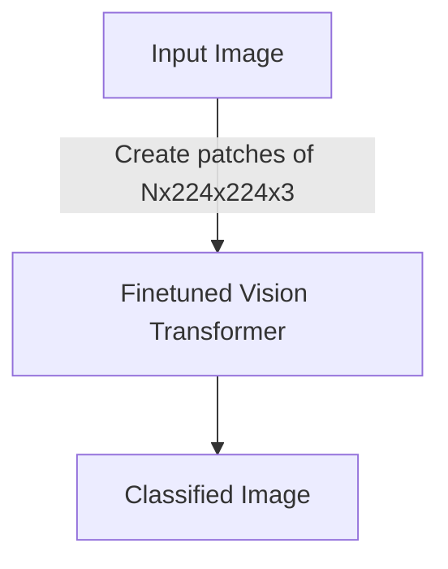
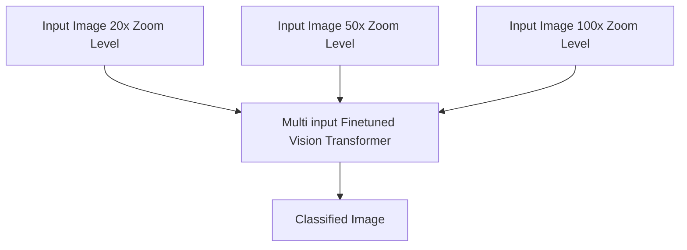

# Metallographic Image Analysis

## ML Model Proposal

```mermaid
flowchart TD
    A[Input Image] --> |Create patches of Nx224x224x3| B[Finetuned Vision Transformer] --> C[Classified Image]
```

## ML Model Proposal v2

```mermaid
flowchart TD
    A[Input Image 20x Zoom Level] --> B[Multi input Finetuned Vision Transformer] --> C[Classified Image]
    D[Input Image 50x Zoom Level] --> B
    E[Input Image 100x Zoom Level] --> B
```
